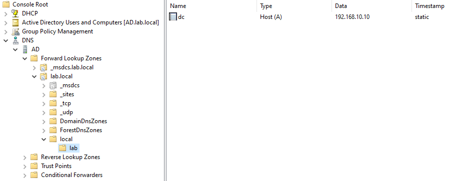
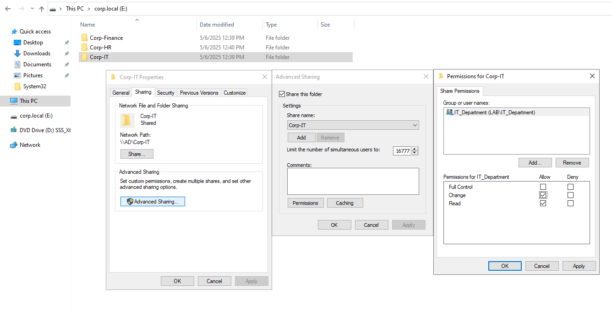

# 🧪 Windows Server 2022 AD Lab Setup

This lab simulates an enterprise Active Directory environment using Windows Server 2022 and Windows 10 clients. It demonstrates key infrastructure skills such as DNS, DHCP, Group Policy, user management, and domain joining.

---

## 1. 🖥️ Virtual Machine Setup

- Deploy:
  - 1× Windows Server 2022 VM (domain controller)
  - 2× Windows 10 client VMs
- Use an Internal Network or Host-Only adapter
- Assign IPs:
  - Server: 192.168.10.10 (DNS points to itself)
  - Clients: Obtain IPs via DHCP

---

## 2. ⚙️ Server Configuration

- Rename the server to AD
- Install the following roles via Server Manager:
  - Active Directory Domain Services (AD DS)
  - DNS Server
  - DHCP Server
- Promote to Domain Controller with the root domain name:
  lab.local
- Configure the DHCP scope and activate it

🖼️ 

---

## 3. 🔧 DNS Setup

- Ensure the lab.local forward lookup zone is created
- Add A and PTR records as needed for the domain controller and clients

🖼️ 

---

## 4. 🧑‍💻 Active Directory Structure

- Create Organizational Units (OUs) for:
  - HR
  - IT
  - Finance
- Create users and groups within each OU

🖼️ 

---

## 5. 🧷 Group Policy Setup

- Create and link a GPO to map shared drives by user group
- Use Group Policy Preferences → Windows Settings → Drive Maps
- Apply based on security group membership

🖼️ 

---

## 6. 📂 Shared Folder Configuration

- Create a shared folder
- Assign:
  - Share permissions to allow access by group
  - NTFS permissions to define read/write access per department

🖼️   

---

## 7. 🖥️ Join Clients to Domain

- Configure each client’s IP settings (DNS = 192.168.10.10)
- Join the domain: corp.local
- Log in using domain user credentials to verify successful domain join and policy application

🖼️ 

---

📌 Author: Liran Karen  
🔗 LinkedIn: [linkedin.com/in/liran-karen](https://www.linkedin.com/in/liran-karen)  
📁 GitHub: [github.com/LiranKaren](https://github.com/LiranKaren)
